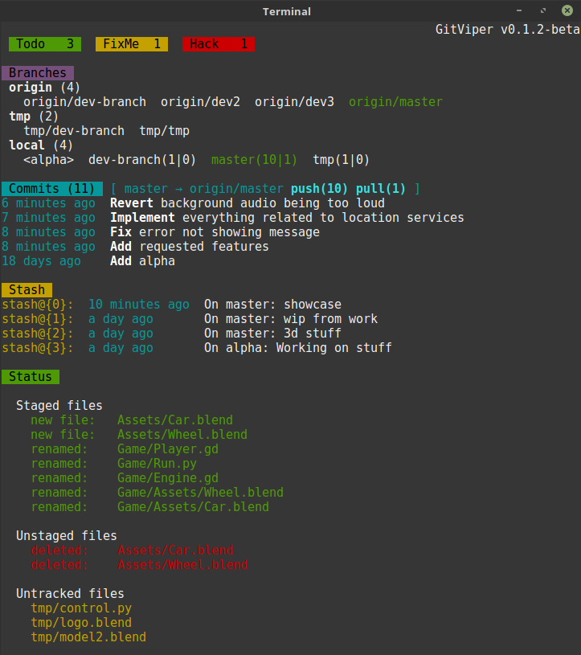
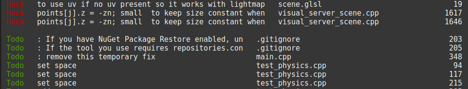

# GitViper
GitViper is a tool to improve the experience when using Git with the command line by showing you the current state of the repository. This tool is designed to only display git related information. You can still work with Git and modify files the way you want.

## Installation
GitViper builds on top of Git, therefore it is required to have Git installed on your system. Just use your package manager to install Git. The command should look something along these lines:
```
sudo apt-get install git
sudo dnf install git
```

GitViper uses **GitPython** for working with the git repository and the **humanize** package to display times and dates in a more readable way.

Both can be installed using

```
pip3 install GitPython
pip3 install humanize
```

which needs:

```
sudo apt install python3-pip
```

Alternativly the humanize package can be installed with

```
sudo apt-get install python3-humanize
```

on Linux Mint or something similar on other distros.

## How to use GitViper
There are two python files you can use. `GitViper.py` is used to display the mainview for the current repository. Your current working directory has to be the root level of a git repsitory.
The second file is `TaskList.py` which is used to list all occurences of task-keywords.

For convenience's sake there is also `GitViperLoader.sh` which can be used to add aliases for these two files to your bash environment by running 
```
source ~/GitViper/GitViperLoader.sh
```
or putting this line into your `.bashrc`. Just make sure you are using the right directory. It also adds some more shortcuts to improve the overall experience. For example if you use this convencience-file aliases all commands clear the screen before showing information. If you just want to use the python files you can still take a look inside this file to see possible calls with different command line arguments. or you can show the help by executing:

```
gitviper --help
```

## Main view


The main view is split into different categories. Each category is only shown if there is content to be shown. You can also disable specific categories by passing arguments to GitViper.

**Tasks**

A task is a keyword you can define. Usually something like `TODO`, `FIXME` or `HACK`. The task category lists the count of all defined keywords throughout the project (directories or filetypes can be excluded). You can adjust these keywords in the `/gitviper/settings.py` file and add priorities to different tasks. The tasks will be sorted descending by their priority. Tasks with priorities lower than 1 will be displayed on a separate line.


**Branches**

Every remote and every branch on the remote is listed.
Every local branch is listed, highlights its tracking branch and shows how many commits it is ahead and behind.

**Commits**

This category shows the last few commits, their committed time and if these commits have different authors, also the authors' names. The first word of each commit message is also highlighted to make it easier to identify each commit's purpose.
The header also shows the tracking branch and how many commits can be pushed or pulled. If the current branch does not have a tracking branch it shows a hint that it is a local branch.

**Stash**

This category shows all stashes, their stash-IDs and their stash messages.

**Status**

The status category shows all staged, unstaged and untracked files. Each subcategory will only be display if there are files that belong to that subcategory.

## Task list


You can display the task list by running the `TaskList.py` file or if you are using the `GitViperLoader.sh` file by running `todo`. The task list is used to show every task (that has been defined in the settings) and where it occurs. It shows the line content, the file name and the line number.

## Settings
Many things that are displayed can be adjusted in the settings files. You can set task-keywords and their priorities and files and directories that should be excluded.
There are two files used for the changing these settings. `settings.py` is a file which basic implementation can be used for every project. `additional_settings.py` is a file used for more specific stuff that should not be commited. Such things could for example be user specific task keywords (e.g. the user's name). Because this file is already tracked in this repository you have to execute 
```
git update-index --assume-unchanged gitviper/additional_settings.py
```
to ignore changes made to this file.

## Feedback and bugs
If you encounter bugs or want to request new features just open an issue.
